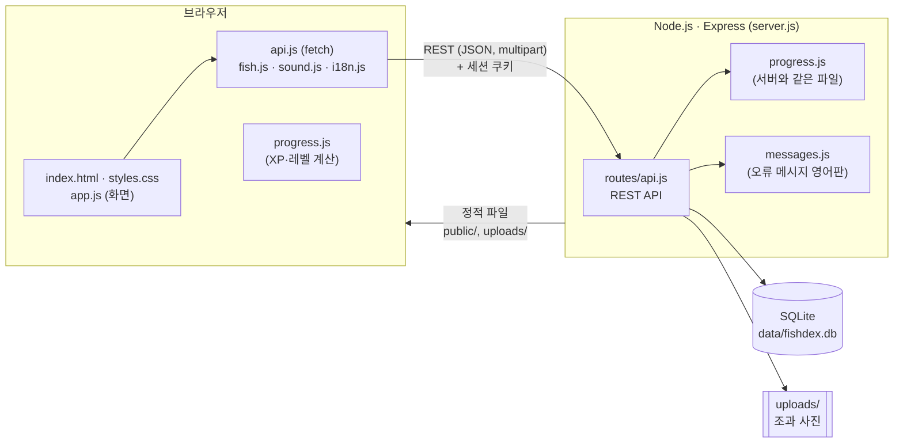
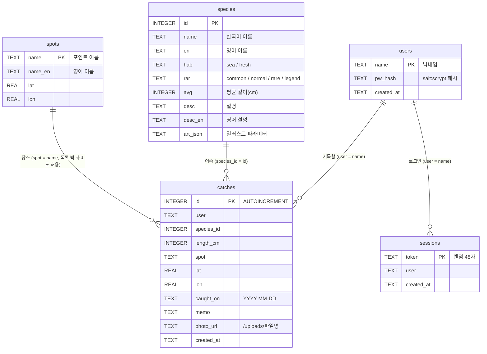
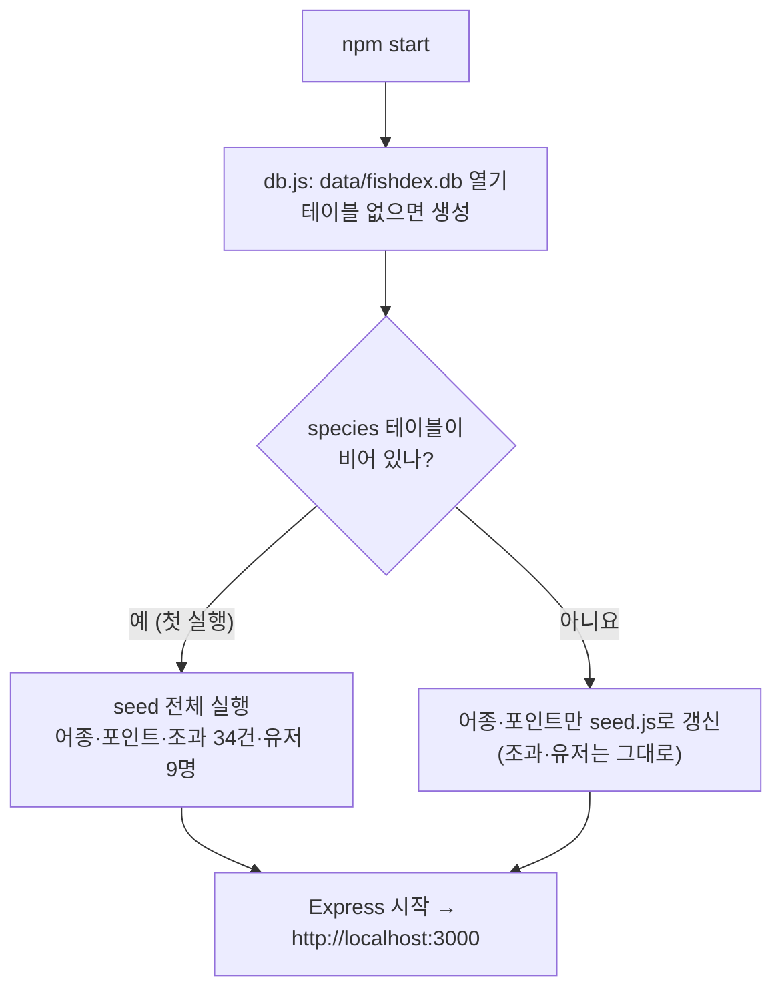
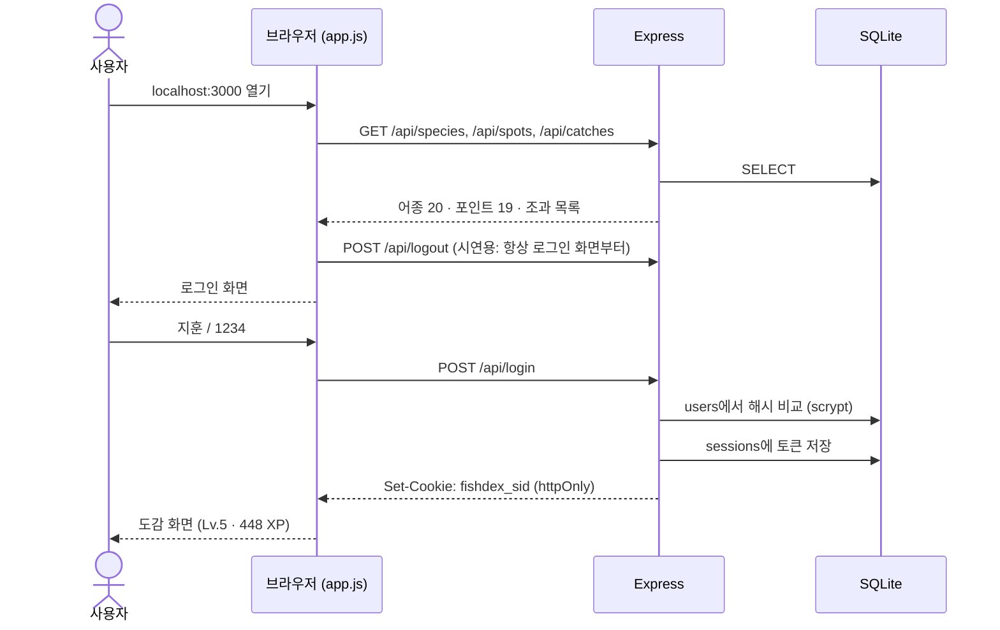
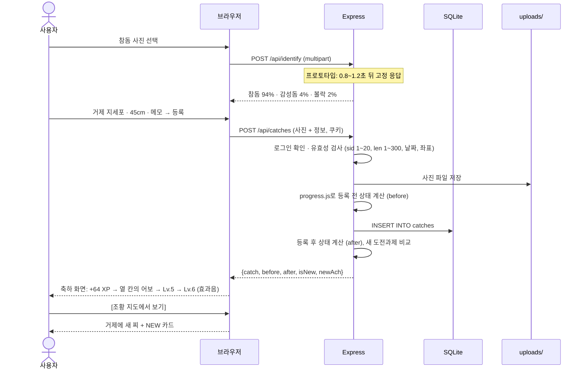
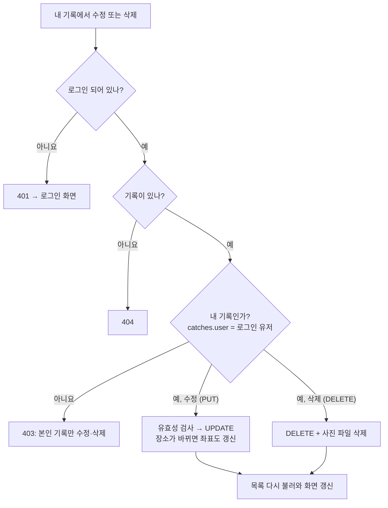

# 손맛어보 기술 문서

기술 스택, DB 테이블, 주요 워크플로우를 정리한 문서입니다. 실행 방법과 API 표는 [README.md](README.md), 영상 촬영 순서는 [DEMO_SCRIPT.md](DEMO_SCRIPT.md)에 있습니다.

## 1. 기술 스택

| 구분 | 기술 | 버전 | 쓰는 곳 |
|---|---|---|---|
| 런타임 | Node.js | 18 이상 (개발: 18.1) | 서버 실행 |
| 웹 서버 | Express | 4.22 | REST API, 정적 파일 제공 (`server.js`, `routes/api.js`) |
| DB | SQLite (better-sqlite3) | SQLite 3.49 / better-sqlite3 11.10 | 파일 DB `data/fishdex.db` (`db.js`) |
| 파일 업로드 | multer | 2.4 | 조과 사진 → `uploads/` 폴더 |
| 인증 | Node 내장 `crypto.scrypt` + httpOnly 쿠키 | – | 비밀번호 해시, 세션 토큰 |
| 프론트엔드 | HTML · CSS · Vanilla JavaScript | – | 빌드 도구·프레임워크 없음 (`public/`) |
| 그래픽 | SVG (코드로 생성) | – | 물고기 일러스트 20종 (`public/fish.js`), 조황 지도 |
| 효과음 | Web Audio API | – | 소리 파일 없이 합성 (`public/sound.js`) |
| 다국어 | 자체 사전 (`t()` 함수) | – | 한국어 / English (`public/i18n.js`, `messages.js`) |
| 테스트 | node:test | Node 내장 | 데모 시나리오 검증 (`test/progress.test.js`) |
| 생성형 AI | Claude | – | 프론트 디자인과 백엔드 코드 생성 |

추가 의존성은 `express`, `better-sqlite3`, `multer` 세 개뿐입니다. 로컬 노트북에서 `npm start` 하나로 실행합니다(클라우드 없음).

## 2. 시스템 구조



- **progress.js 공유**: XP·레벨·도전과제 계산 파일 하나를 서버(`require`)와 브라우저(`<script>`)가 함께 씁니다. 그래서 화면에 보이는 레벨과 서버가 계산한 레벨이 어긋나지 않습니다.
- **기준 데이터 동기화**: 서버가 켜질 때마다 `seed.js`의 어종 20종과 포인트 19곳을 DB에 덮어씁니다. 조과·유저 데이터는 DB가 비어 있을 때만 seed로 채웁니다.

## 3. DB 테이블

SQLite 파일 하나(`data/fishdex.db`)에 테이블 5개가 있습니다. 외래 키 제약은 걸지 않았고, 아래 관계는 코드에서 지키는 논리적 관계입니다.



| 테이블 | 역할 | 초기 데이터 | 데모 초기화 때 |
|---|---|---|---|
| `species` | 도감 어종 20종 (이름, 서식지, 희귀도, 설명, 일러스트) | 20행 | 다시 채움 |
| `spots` | 낚시 포인트 19곳 (지도 좌표) | 19행 | 다시 채움 |
| `catches` | 조과 기록 (CRUD 대상) | 34행 (지훈 10건 + 예시 유저 24건) | 비우고 다시 채움 |
| `users` | 계정 (비밀번호는 해시만 저장) | 9명, 비밀번호 모두 `1234` | 비우고 다시 채움 (가입 계정 삭제) |
| `sessions` | 로그인 세션 토큰 | 없음 | **유지** (시연 중 로그인이 풀리지 않도록) |

- `catches.lat/lon`은 포인트 좌표에 작은 흔들림(`jit(id, k)`)을 더한 값이라, 같은 포인트의 기록도 지도에서 겹치지 않습니다.
- XP·레벨은 테이블에 저장하지 않고, 요청할 때마다 그 유저의 `catches`로 계산합니다.

## 4. 워크플로우

### 4-1. 서버 시작



### 4-2. 페이지 열기와 로그인



### 4-3. 조과 등록 (Create) — 데모의 핵심



유효성 검사에 실패하면 서버가 `400 {error}`를 돌려주고, 화면은 그 메시지를 토스트로 띄웁니다. 업로드된 사진은 이때 지웁니다.

### 4-4. 수정·삭제 (Update / Delete)



### 4-5. 데모 초기화

설정 탭의 **[초기화]** 또는 **Shift+R** → `POST /api/demo/reset`

1. `catches`, `species`, `spots`, `users`를 비우고 seed로 다시 채움
2. `uploads/`의 사진 파일 삭제
3. `sessions`는 그대로 → 로그인이 유지된 채 지훈 Lv.5 · 448 XP로 돌아감

새로고침은 데이터를 지우지 않고 로그아웃만 합니다.

## 5. 게임 규칙 (progress.js)

- **XP** = 10 + round(길이cm ÷ 5) + 희귀도 보너스(흔함 0 · 보통 5 · 희귀 15 · 전설 40) + 그 유저의 첫 어종이면 30
- 날짜순, 같은 날짜면 id순으로 누적
- **레벨 기준 XP**: 0 · 60 · 140 · 240 · 360 · 500 · 660 · 840 · 1040 · 1260 · 1500 (최대 Lv.10)
- **도전과제 9개**: 첫 손맛 · 어보 입문(5종) · 열 칸의 어보(10종) · 어보 완성(20종) · 대물 사냥꾼(50cm) · 바다와 강 · 전국 일주(6곳) · 한 우물 파기(같은 어종 5마리) · 전설의 손맛

예: 지훈(448 XP)이 참돔(희귀, 처음) 45cm를 등록하면 10 + 9 + 15 + 30 = **64 XP** → 512 XP, Lv.6. `npm test`가 이 값을 자동으로 검증합니다.

## 6. 폴더 구조

```
fishdex/
├─ server.js            Express 앱: API + 정적 파일
├─ db.js                SQLite 연결, 테이블 생성, seed · 기준 데이터 동기화
├─ seed.js              어종 20 · 포인트 19 · 예시 조과 34 · 예시 유저
├─ progress.js          XP / 레벨 / 칭호 / 도전과제 (서버·브라우저 공용)
├─ messages.js          서버 오류 메시지 영어판
├─ routes/api.js        REST API (인증, CRUD, 판별, 초기화)
├─ test/progress.test.js  데모 시나리오 검증 (node:test)
├─ data/                fishdex.db (git 제외)
├─ uploads/             업로드 사진 (git 제외)
└─ public/
   ├─ index.html · styles.css
   ├─ app.js            화면 로직
   ├─ api.js            서버 호출
   ├─ fish.js           물고기 일러스트 생성 (SVG)
   ├─ i18n.js           한국어/English 문구, 설정 저장
   └─ sound.js          효과음 (Web Audio)
```
